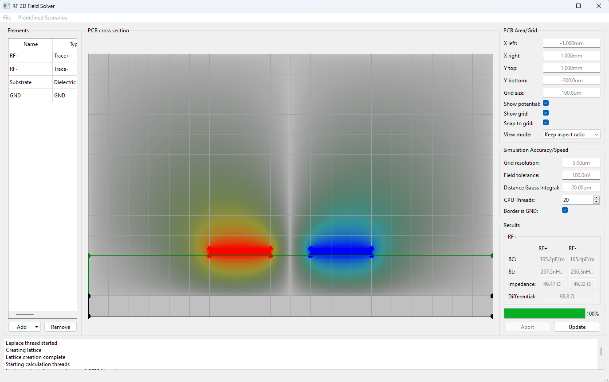
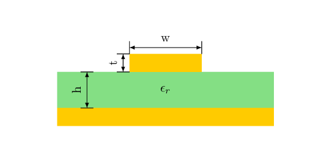
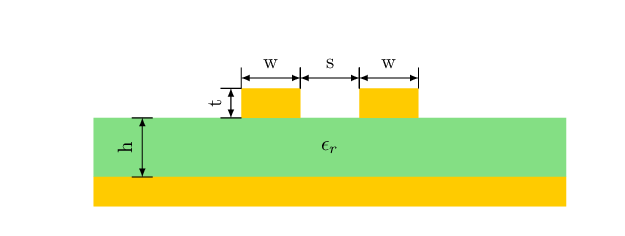
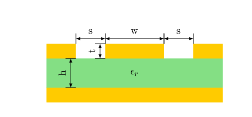
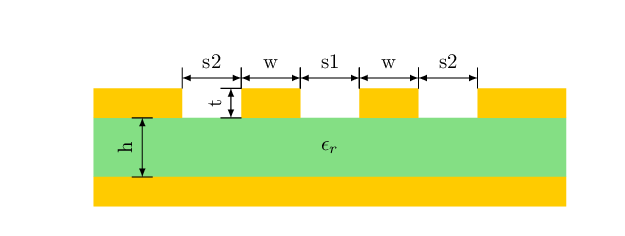
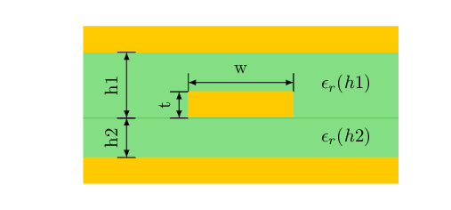
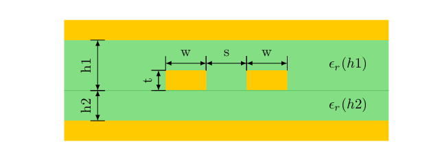
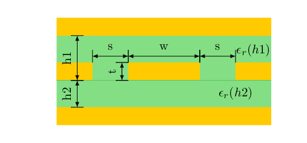
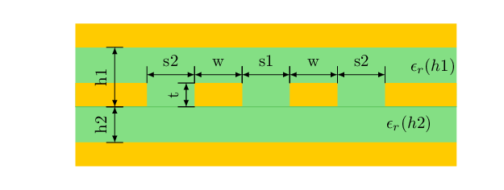

# RF 2D Field Solver

Did you ever route a PCB and needed to figure out how wide a trace needs to be to reach a specific impedance? This tool can calculate that for you.

I can already imagine the next question:
##### But aren't there a lot of free online calculators for that purpose already? Why would I need to simulate this?

Well yes, but actually no:

- Most available calculators are based on approximate formulas. Change the proportions to something where these formulas are no longer valid, and you get a wrong result
- The results from several calculators actually differ by a surprising amount (see below)
- If you have a specific geometry which isn't covered by any of the calculators, you need a field solver. This could for example be gaps in the ground plane or multiple different dielectrics between the trace and the reference plane

##### Will this tool solve all my problems with calculating impedances?

Ideally yes, but it is not that straightforward. In theory, a field solver should give you a perfect result. In practice, the accuracy will depend on the grid size and tolerance for the simulation. Getting these values right for an acceptable simulation time while still getting good results can be tricky.

## How to use the field solver

1. Configure the area size
2. Set up the elements (RF traces, GND planes, dielectric substrates)
3. Select simulation parameters (simulation grid resolution, tolerance, distance of Gauss integral from RF conductors)
4. Start the simulation
5. View the potential field and the calculated impedances

##### Predefined scenarios

The real use case is the simulation of non-standard elements. But creating the structure can take some time. If used for standard traces, several predefined scenarios are available to speed up creating the elements:

|     References      |                         Single Ended                         |                         Differential                         |
| :-----------------: | :----------------------------------------------------------: | :----------------------------------------------------------: |
|     Microstrip      |           |  |
| Coplanar Microstrip |  |  |
|      Stripline      |            |  |
| Coplanar Stripline  |   |  |

## How does the calculation work?

The first step of the solver is calculating the potential for every point in the plane. This is done with the Laplace equation and [this](https://github.com/gpollo/laplace) library. In the next step, the charge on each RF conductor is determined by calculating the Gauss integral around it (integrating the field lines going in to the conductor). The Gauss integral is calculated twice, once with the dielectric constant and once without the dielectric constant (assumes air around the conductors). Based on [these](https://eng.libretexts.org/Bookshelves/Electrical_Engineering/Electronics/Microwave_and_RF_Design_II_-_Transmission_Lines_(Steer)/03%3A_Planar_Transmission_Lines/3.05%3A_Microstrip_Transmission_Lines) formulas, the line constants (capacitance/meter and inductance/meter) can be determined which ultimately allow calculating the impedance as well.

## Comparison to other calculators
How do the results from this field solver compare to other calculators? Here are some very simple scenarios with calculated impedances from different tools:

### Scenarios
- Microstrip:
  - 0.3 mm trace width
  - 35 um trace height
  - 0.2 mm substrate height
  - 4.3 &epsilon;_r
- Stripline:
  - 0.15 mm trace width
  - 35 um trace height
  - 0.2 mm substrate below the trace
  - 0.2 mm substrate above the trace (bottom of the trace to the reference plane above)
  - Common &epsilon;_r of 4.1
- Asymmetrical stipline:
  - 0.3 mm trace width
  - 35 um trace height
  - 0.3 mm substrate below the trace
  - 0.4 mm substrate above the trace (bottom of the trace to the reference plane above)
  - &epsilon;_r of substrate abofe trace: of 3.3
  - &epsilon;_r of substrate abofe trace: of 4.7

### Calculators
- This 2D Field Solver
- All About Circuits: https://www.allaboutcircuits.com/tools/microstrip-impedance-calculator/ and https://www.allaboutcircuits.com/tools/symmetric-stripline-impedance-calculator/
- PCBWay: https://www.pcbway.com/pcb_prototype/impedance_calculator.html
- Pasternack: https://www.pasternack.com/t-calculator-microstrip.aspx and https://www.pasternack.com/t-calculator-stripline.aspx
- Multi-CB: https://www.multi-circuit-boards.eu/en/pcb-design-aid/impedance-calculation.html1
- Elektroda: https://www.elektroda.com/calculators/
- The integrated impedance calculator of Altium Designer: https://resources.altium.com/p/pcb-stackup-impedance-calculator
- em:talk: https://www.emtalk.com/mscalc.php
- The calculator tool in KiCad: https://docs.kicad.org/8.0/en/pcb_calculator/pcb_calculator.pdf
- Chemandy: https://chemandy.com/calculators/microstrip-transmission-line-calculator.htm

### Results
|     Calculator      |    Microstrip    |    Stripline   |    Asymmetrical stripline   |
| :-----------------: | :--------------: | :------------: | :-------------------------: |
| RF 2D Field Solver  |  55.5 &Omega;    |  49.4 &Omega;  |  50.7 &Omega;               |
| All About Circuits  |  55.2 &Omega;    |  49.3 &Omega;  |  47.5 &Omega; (different &epsilon;_r not possible, using 4.0 for both)  |
| PCBWay              |  55.3 &Omega;    |  49.3 &Omega;  |  Not possible               |
| Pasternack          |  58.3 &Omega;    |  49.6 &Omega;  |  Not possible               |
| Multi-CB            |  53.5 &Omega;    |  Not possible  |  Not possible               |
| Ekekroda            |  55.2 &Omega;    |  49.3 &Omega;  |  47.5 &Omega; (different &epsilon;_r not possible, using 4.0 for both)  |
| Altium Designer     |  55.8 &Omega;    |  50.6 &Omega;  |  49.1 &Omega;               |
| em:talk             |  58.3 &Omega;    |  Not possible  |  Not possible               |
| KiCad               |  55.9 &Omega;    |  47.4 &Omega;  |  Not possible               |
| Chemandy            |  54.5 &Omega;    |  Not possible  |  Not possible               |

Even for the simplest scenario of a normal microstrip, there is some variation in the values from different calculators. For more unusual scenarios, a lot of the calculators can not produce a value at all or some simplifications must be done. The situation gets even worse for differential traces and coplanar coupling.

